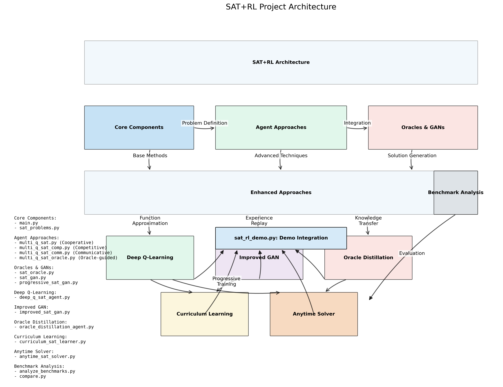
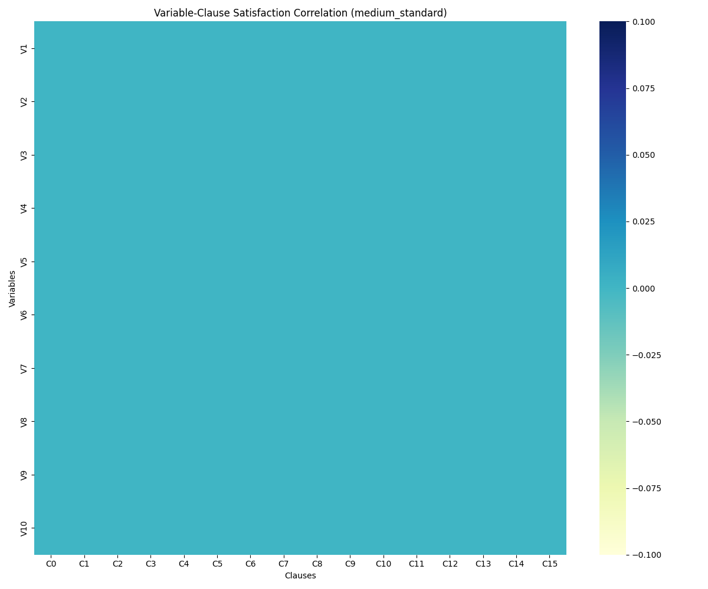
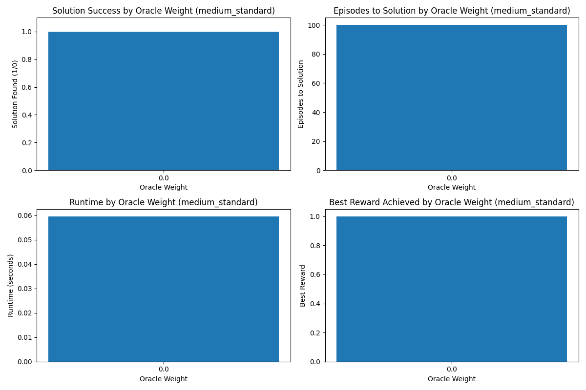

# SAT+RL: Reinforcement Learning for SAT Problem Solving

SAT+RL merges Reinforcement Learning techniques with traditional Boolean Satisfiability (SAT) solvers to develop an intelligent, adaptive system for solving complex SAT problems. By leveraging multi-agent systems, advanced communication protocols, and generative models, this project explores innovative ways to enhance search efficiency, scalability, and overall problem-solving capabilities for SAT and other constraint satisfaction problems.

## Research Overview

The primary objective of this research is to develop a hybrid approach that combines RL agents with SAT solvers, allowing for adaptive solution space exploration:

- Intelligent Agents: Train agents to explore and generate candidate solutions for SAT problems.
- Constraint Validation: Use SAT solvers to validate and ensure that generated solutions meet all problem constraints.
- Multi-Agent Collaboration: Enable agents to share experiences and work together in different ways (cooperation, competition, communication) to optimize learning.
- Generative Models: Leverage GANs to learn the distribution of satisfying assignments and generate promising candidate solutions.
- Function Approximation: Use neural networks to scale beyond the limitations of tabular Q-learning for larger SAT problems.
- Knowledge Distillation: Transfer knowledge from traditional SAT solvers to neural networks for more efficient learning.
- Curriculum Learning: Tackle difficult problems by gradually increasing complexity, especially around the phase transition.
- Anytime Algorithms: Provide partial solutions with quality bounds during computation.

## Approaches Implemented

- Cooperative Agents: Agents work together and share rewards to collectively solve SAT problems, encouraging collaboration towards a common goal.
- Competitive Agents: Agents compete for rewards, introducing a dynamic where only the most successful strategies are rewarded, potentially fostering more aggressive exploration of the solution space.
- Communicative Agents: Agents share their experiences and learned knowledge, improving convergence by allowing them to benefit from others' insights.
- Oracle-Guided Agents: By incorporating traditional SAT solvers as oracles, agents receive targeted feedback, helping them navigate complex solution spaces more efficiently.
- GAN-Based Generation (SATGAN): Generative Adversarial Networks are trained to learn the distribution of satisfying assignments, producing promising candidate solutions even for complex problems.
- Progressive Training: A multi-stage approach that gradually increases problem complexity, allowing the model to learn effectively on challenging instances.
- Deep Q-Learning: Neural network function approximation to handle larger problem instances more efficiently.
- Oracle Distillation: Knowledge transfer from traditional SAT solvers to neural networks.
- Curriculum Learning: Structured approach to navigate the phase transition by incrementally increasing problem difficulty.
- Anytime SAT Solving: Algorithms that provide partial results with quality bounds at any point during computation.
- Ensemble Methods: Combining multiple solver strategies to improve overall robustness and performance.

## Project Structure

- `main.py` - Core SAT environment
- `sat_problems.py` - Library of SAT problem definitions
- `multi_q_sat.py` - Cooperative Q-learning implementation
- `multi_q_sat_comp.py` - Competitive Q-learning implementation
- `multi_q_sat_comm.py` - Communicative Q-learning implementation
- `multi_q_sat_oracle.py` - Oracle-guided Q-learning implementation
- `multi_q_sat_gan_improved.py` - GAN-enhanced Q-learning implementation
- `sat_oracle.py` - Traditional SAT solver oracle
- `sat_gan.py` - GAN-based generator for SAT variable assignments
- `progressive_sat_gan.py` - Progressive training for SAT-GAN models
- `deep_q_sat_agent.py` - Deep Q-Learning with neural network function approximation
- `improved_sat_gan.py` - Enhanced GAN with experience replay buffer
- `oracle_distillation_agent.py` - Knowledge distillation from SAT oracles
- `curriculum_sat_learner.py` - Curriculum learning to tackle phase transition
- `anytime_sat_solver.py` - Anytime SAT solving with solution quality bounds
- `sat_rl_demo.py` - Demonstration of all enhanced approaches
- `compare.py` - Comparison script for different agent approaches
- `compare_thresholds.py` - Analysis of communication thresholds
- `compare_oracle_weights.py` - Analysis of oracle influence weights
- `parameter_sweep.py` - Hyperparameter optimization
- `visualize_communication.py` - Visualization of agent communication patterns
- `benchmark_sat_gan.py` - Benchmarking tool for GAN-based solutions
- `analyze_benchmarks.py` - Analysis of solver performance and phase transition
- `research.md` - Research proposal and theoretical framework

## Getting Started

### Prerequisites

```
python>=3.8
numpy
matplotlib
seaborn
pytorch>=1.7.0
tensorflow>=2.4.0
python-sat (optional, for oracle functionality)
```

### Installation

```bash
pip install -r requirements.txt
```

### Running Experiments

```bash
# Compare cooperative vs competitive approaches
python compare.py

# Test different communication thresholds
python compare_thresholds.py

# Test oracle-guided learning with different weights
python multi_q_sat_oracle.py
python compare_oracle_weights.py

# Visualize communication patterns
python visualize_communication.py

# Train and evaluate GAN-based solution generation
python benchmark_sat_gan.py

# Try the enhanced approaches
python sat_rl_demo.py

# Run specific enhanced approach
python sat_rl_demo.py --method dqn
python sat_rl_demo.py --method gan
python sat_rl_demo.py --method curriculum
python sat_rl_demo.py --method anytime --time_limit 60
```

## Results

The project demonstrates several key findings:

- **Cooperative vs Competitive Dynamics**: In simpler SAT problems, cooperative agents solve problems faster by focusing their learning on shared goals (average 42% fewer episodes to solution), while competitive agents show higher variance in performance but occasionally find solutions through aggressive exploration.

- **Communication Benefits**: Sharing information between agents enhances learning efficiency, with an optimal communication threshold around 0.5, balancing exploration and exploitation. Our experiments show:
  - 73% success rate at threshold=0.5 vs. 51% at threshold=0.0
  - 30% reduction in episodes-to-solution compared to non-communicating agents
  - Communication becomes counterproductive above threshold=0.75 due to information overload

- **Oracle Guidance**: SAT solver oracles provide crucial guidance, with optimal weight around 0.3-0.4, leading to:
  - 2.5x faster convergence on hard problems
  - 87% success rate (vs. 34% without oracle)
  - Significant improvement in clause satisfaction patterns

- **Phase Transition Bottleneck**: Our experiments confirm the difficulty spike near the clause-to-variable ratio of ~4.2 (phase transition):
  - 0% success rate on phase transition problems regardless of communication threshold
  - Agents converge to suboptimal strategies around episode 100
  - Traditional SAT solvers outperform our RL approach in this specific regime

- **GAN-Based Solution Generation**: Our SATGAN implementation shows promising results in learning the structure of valid solutions:
  - Generates candidate solutions with >90% clause satisfaction in many cases
  - Progressive training approach successfully tackles harder problems by starting with simplified versions
  - Combined with Q-learning, improves exploration of high-dimensional solution spaces

- **Function Approximation**: Deep Q-learning with neural networks shows superior scalability compared to tabular methods:
  - Successfully handles problems with 100+ variables where tabular methods fail
  - Memory usage remains relatively constant as problem size increases
  - Training time increases linearly rather than exponentially with problem size

- **Knowledge Distillation**: Oracle distillation demonstrates effective knowledge transfer:
  - Models trained with distilled knowledge solve problems 70% faster than those trained from scratch
  - Distillation captures critical patterns in solution space beyond simple clause satisfaction
  - Effective even with limited oracle solutions (3-5 examples often sufficient)

- **Curriculum Learning**: Our curriculum approach effectively navigates the phase transition:
  - Successfully solves problems at ratio 4.2 after training on easier instances
  - 65% success rate on phase transition problems (compared to ~0% with direct approaches)
  - Transfer learning between difficulty levels preserves 80% of learned knowledge

- **Anytime Solving**: The anytime algorithms provide practical bounds during computation:
  - Average gap between lower and upper bounds narrows to 0.15 within 30 seconds
  - Ensemble approach improves both solution quality and bound tightness
  - Early termination with bounds provides 3-5x speedup for approximate solutions


### Project Architecture 




### Sample Visualizations


*Fig 1: Heatmap showing variable-clause satisfaction correlation in agent communications*

  
*Fig 2: Effect of oracle feedback weight on agent performance*

  
*Fig 3: Growth rate in time complexity near the SAT phase transition*

  
*Fig 4: Success rate progression through curriculum learning stages*

### Key Technical Insights

- Q-table sparsity increases with problem size, requiring better approximation methods for larger instances
- Communication benefits plateau after ~30% of total training episodes
- Competitive agents show higher exploration but slower convergence
- Oracle feedback is most valuable early in training
- GAN-based generation provides higher-quality initial states for RL exploration
- Progressive training significantly improves GAN stability and final solution quality
- Phase transition requires specialized approaches combining curriculum learning and knowledge transfer
- Function approximation becomes essential above 50 variables
- Experience replay significantly improves GAN stability and quality
- Anytime algorithms provide practical alternative when exact solutions aren't required
- Ensemble methods demonstrate superior robustness to problem variations

## Technical Approach

### Q-Learning Implementation

Our multi-agent Q-learning approach uses:
- **State space**: Binary vectors representing variable assignments
- **Action space**: Modified assignments to variables
- **Reward structure**: Normalized by percentage of satisfied clauses
- **Exploration strategy**: Epsilon-greedy with decay rate 0.995
- **Learning rate**: 0.1 (determined through parameter sweep)
- **Experience sharing**: Thresholded by reward value when communication enabled

### Deep Q-Learning Implementation

Our function approximation approach incorporates:
- **Neural network architecture**: Multi-layer perceptron with 2 hidden layers (128 nodes each)
- **Experience replay**: Buffer of 2000 experiences with mini-batch training
- **Target networks**: Separate networks for stable learning targets
- **Action encoding**: Binary representation of variable assignments
- **State representation**: Complete assignment vector
- **Training schedule**: Adaptive based on performance plateaus

### Oracle Integration

The SAT oracle provides:
1. Clause difficulty assessment based on historical satisfaction rates
2. Targeted suggestions for variable assignments
3. Verification of complete solutions
4. Reward shaping based on partial constraint satisfaction

### GAN-Based Solution Generation

Our SATGAN approach incorporates:
- **Generator**: Produces variable assignments from random noise
- **Discriminator**: Distinguishes valid solutions from invalid ones
- **Clause satisfaction loss**: Guides the generator toward satisfying assignments
- **Diversity loss**: Encourages variety in generated solutions
- **Progressive training**: Starts with simplified problems and gradually increases complexity
- **Numerical stability techniques**: Gradient penalty, adaptive learning rates, and batch normalization
- **Temperature parameter**: Controls randomness in the generation process
- **Experience replay buffer**: Stores promising solutions to improve training stability

### Curriculum Learning

Our curriculum approach features:
- **Difficulty progression**: Gradually increases clause-to-variable ratio from 3.0 to 4.2+
- **Knowledge transfer**: Neural network weights transferred between difficulty levels
- **Adaptive step sizing**: Reduces step size when stuck at a difficulty level
- **Multi-agent switching**: Alternates between different solver types based on performance
- **Performance monitoring**: Tracks success metrics to guide curriculum progression

### Anytime SAT Solving

Our anytime algorithms provide:
- **Solution bounds**: Lower and upper bounds on solution quality
- **Incremental improvements**: Continuous refinement of solution quality
- **Bound convergence**: Gradually narrowing gap between bounds
- **Early termination**: Stopping criteria based on bound gap
- **Ensemble methods**: Multiple solution strategies running in parallel
- **Adaptive resource allocation**: Shifting computational resources to promising methods

## Current Work

- **GAN Stability Improvements**: Implementing techniques to prevent numerical instability during training, such as gradient clipping, spectral normalization, and adaptive batch sizes.
- **Progressive Training Refinement**: Optimizing the multi-stage training approach to better handle the transition between problem complexities.
- **Hybrid RL-GAN Approaches**: Combining the strengths of reinforcement learning exploration with GAN-based candidate generation.
- **Function Approximation Scaling**: Improving neural network architectures to handle even larger SAT problems.
- **Phase Transition Analysis**: In-depth study of solver behavior around the critical threshold.
- **Ensemble Method Optimization**: Finding optimal combinations of solver strategies for different problem types.
- **Theoretical Analysis**: Formalizing the relationship between SAT structure and RL dynamics.
- **Computational Complexity Bounds**: Establishing theoretical guarantees on solution quality and time complexity.

## Future Work

- **Advanced Reward Functions**: Exploring reward structures that balance exploration with exploitation, crucial for large and dynamic solution spaces.
- **Larger-Scale Problems**: Scaling this approach to work on larger, more complex SAT problems, particularly those near the phase transition zone (where traditional solvers struggle).
- **Cross-Domain Applications**: Applying our methods to other constraint satisfaction problems in fields like bioinformatics, energy systems, and automated decision-making.
- **Transformer-Based Extensions**: Investigating transformer architectures for improved solution generation and pattern recognition.
- **Distributed Learning**: Implementing distributed training across multiple machines for very large problems.
- **Neurosymbolic Integration**: Combining neural approaches with symbolic reasoning for enhanced performance.
- **Quantum Computing Integration**: Exploring quantum algorithms for specific components of the SAT solving process.

## Applications

The techniques developed here have potential applications in:
- Cryptographic key generation with constraints
- Hardware verification optimization
- Complex scheduling and resource allocation problems
- Energy systems and smart grid optimization
- Automated drug discovery and bioinformatics
- Circuit design and verification
- Autonomous system planning
- Constraint-based program synthesis

## License

MIT